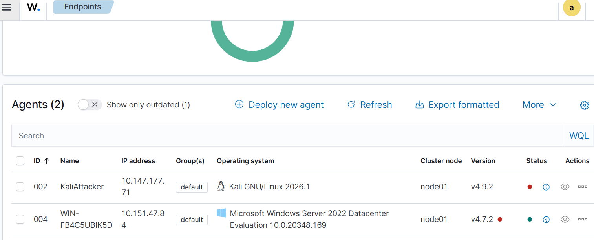
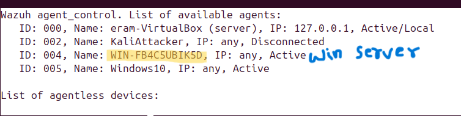
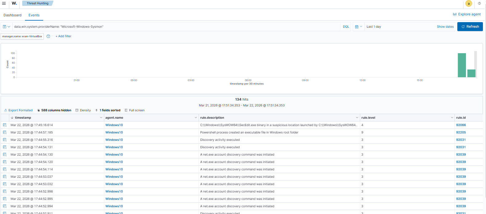
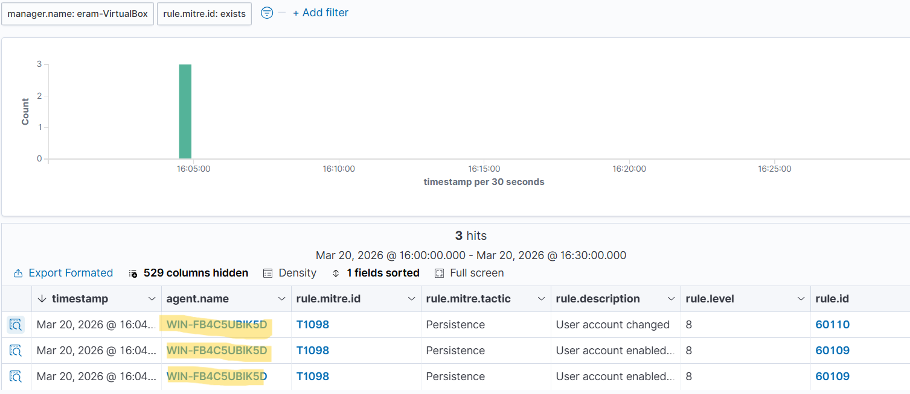
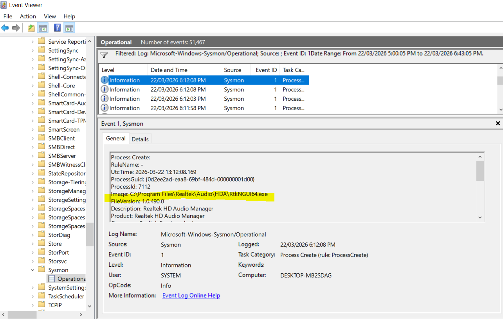

**Hybrid Enterprise SOC Lab: Ubuntu Wazuh, Windows Server 2022 & Physical Endpoint Integration**

**Project Overview**

I have designed and implemented a hybrid Security Operations Center (SOC) laboratory that simulates real-world enterprise monitoring across both physical and virtual environments.

In this architecture, a physical Windows 10 machine functions as the primary user endpoint and access interface, at the same time operating as a Wazuh agent to provide endpoint telemetry. The core security infrastructure is deployed within a virtualized environment, where an Ubuntu-based Wazuh server acts as the centralized log management and analysis platform.
Additionally, a Windows Server 2022 virtual machine is integrated into the environment as a monitored asset, also configured with the Wazuh agent.

Both the physical Windows 10 system and the virtual Windows Server continuously forward security events and system logs to the Wazuh server, enabling centralized visibility, real-time monitoring, and threat detection through the Wazuh dashboard.

Tech Stack

SIEM/XDR: Wazuh

Operating Systems: Windows Server 2022, Ubuntu Linux, Windows 10

Virtualization: Oracle VM VirtualBox

Telemetry Tools: Microsoft Sysmon, Windows Event Viewer

Detection Logic: Wazuh XML-based Custom Rules

Networking: Windows Defender Firewall (TCP/UDP Port Management)

Frameworks: MITRE ATT&CK

System Tools: Registry Editor (Regedit), PowerShell, CLI

Environment: Hybrid Infrastructure (Physical & Virtual Integration)

**Business Value & Risk Mitigation**

This hybrid setup directly addresses enterprise security challenges by demonstrating:

Full Visibility: Monitoring both virtual servers and physical workstations from a single pane of glass.

Alert Fatigue Management: By identifying and silencing "False Positives" (like PowerShell policy tests), I optimized the system to focus on high-fidelity alerts, saving critical analyst time.

Cost-Effective Scalability: Utilizing open-source tools to provide enterprise-grade protection, proving that repeatable security results can be achieved without massive licensing costs.

This hybrid deployment effectively demonstrates how security monitoring can be unified across physical endpoints and virtual infrastructure, closely mirroring modern enterprise SOC architectures.

**Technical Implementation**

1. Hybrid Infrastructure

**Wazuh Manager:**
Deployed on an Ubuntu-based virtual machine (VirtualBox), serving as the centralized SIEM platform for log collection, analysis, and visualization.

**Monitored Endpoints:**
Integrated a Windows Server 2022 virtual machine as a monitored asset within the lab environment. Additionally, the physical Windows 10 system was configured as a Wazuh agent, enabling real-time endpoint telemetry from a non-virtualized host.

**Physical Integration:**
Successfully registered the physical Windows machine as a live Wazuh agent, allowing ingestion of real-world system events and enhancing the realism of the SOC simulation.

**Networking Configuration:**
Established reliable communication between virtual and physical components by configuring Windows Defender Firewall rules to allow agent-to-manager communication by enabling required ports (e.g., TCP/UDP 1514 and TCP 1515), ensuring uninterrupted log transmission.

**2. Advanced Telemetry (Sysmon)**
   
**Sysmon Deployment:**

Deployed Microsoft Sysmon across monitored Windows endpoints (Windows 10 and Windows Server 2022) using a customized configuration to significantly enhance visibility beyond default Windows logging.

**Enhanced Event Collection:**

Configured Wazuh to collect and analyze logs from the Sysmon Operational Event Channel, enabling deep visibility into low-level system activities such as Process Creation (Event ID 1) and File Creation (Event ID 11).

**Detection Enablement:**

Leveraged enriched telemetry to detect security-relevant activities, including brute-force login attempts, user account creation, and privilege escalation events. These activities were identified through correlation of Windows Security Event IDs and mapped to Wazuh detection rules.

**Threat Mapping (MITRE ATT&CK):**

Successfully observed alerts mapped to MITRE ATT&CK technique T1098 (Account Manipulation – Persistence), demonstrating the ability to detect unauthorized account creation and administrative privilege assignment within the environment.

**3.Detection Engineering & Tuning**

**Telemetry Validation:**

Analyzed raw telemetry using Windows Event Viewer to establish baseline system behavior and validate log integrity before applying detection logic.

**Custom Rule Development & Validation:**

Developed custom Wazuh XML-based rules to suppress alerts for benign executable activity (e.g., trusted setup/installation files) in order to minimize unnecessary alert generation.

To validate rule effectiveness, events were cross-verified by correlating Wazuh dashboard activity with corresponding logs in Windows Event Viewer (based on timestamp filtering). This ensured that system activity was successfully captured at the log level while appropriately filtered at the SIEM detection layer.

**Noise Reduction & Optimization:**

Tuned detection logic to reduce false positives and improve the signal-to-noise ratio, ensuring that only meaningful and actionable security alerts are surfaced for analysis.

**Conclusion**

This hands-on experience strengthens my understanding of SOC workflows, including log analysis, alert validation, and rule tuning in a controlled lab environment.
I am continuously working to expand this lab by incorporating advanced detection use cases and real-world attack simulations.
